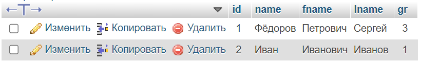
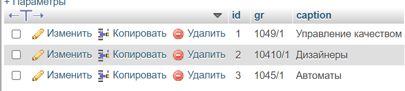
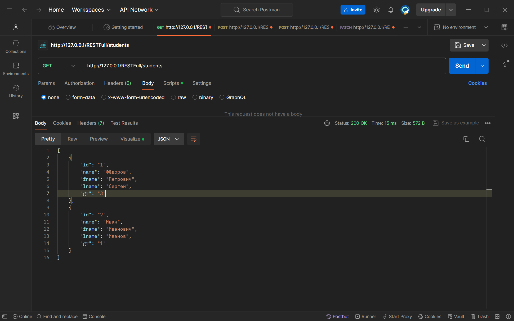
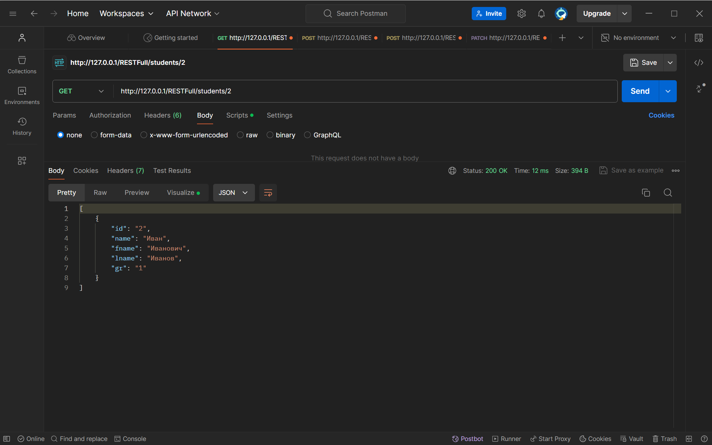
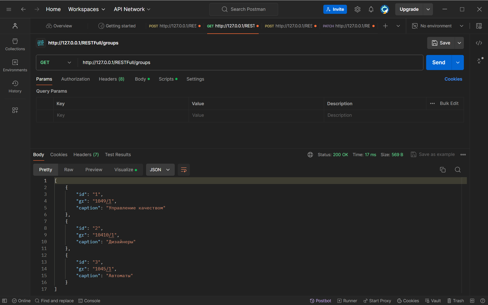
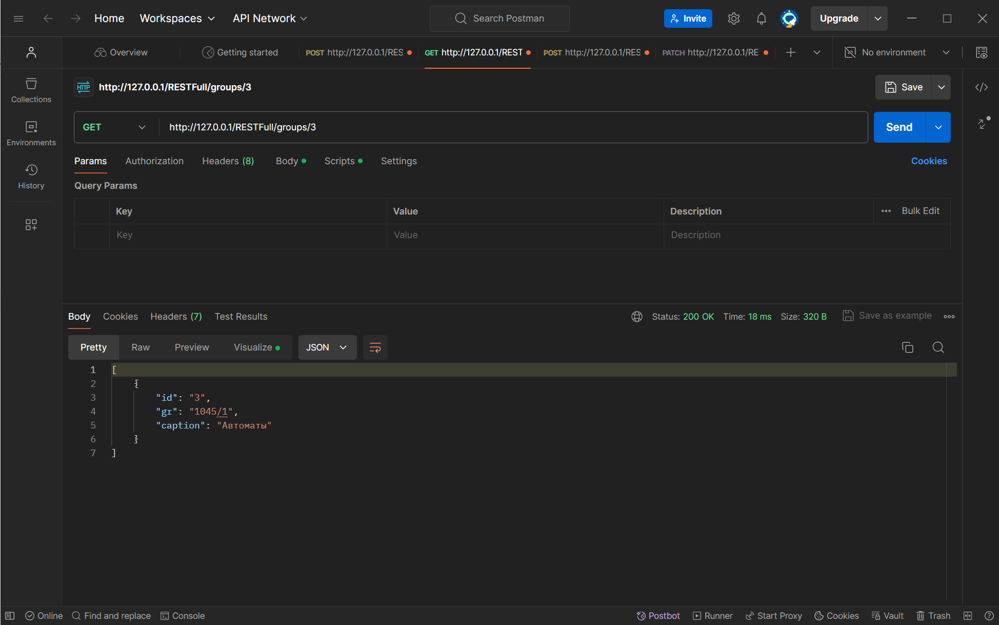
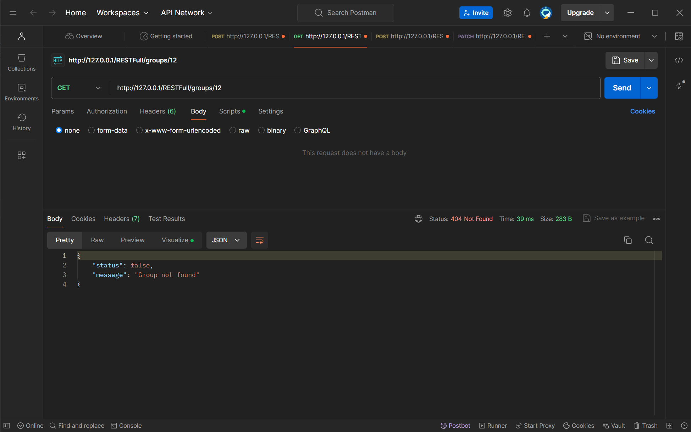
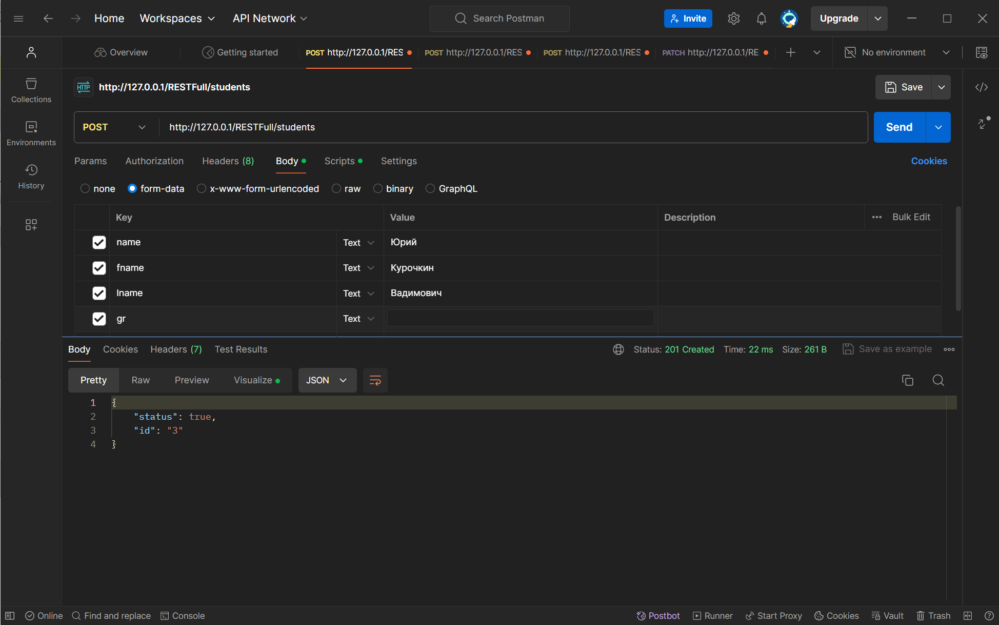
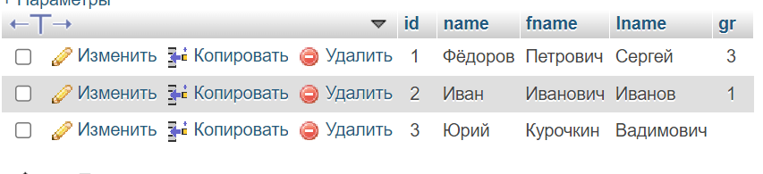

## Дисциплина: Проектирование и построение микросервисных систем Группа: 5142704/30801 Преподаватель: Ефремов Владислав Александрович Студент: Косов Максим Михайлович

# Цель
Разобраться в работе RESTful.

# Задача
Разработать fastapi проект, предоставляющий api для сохранения и получении информации о студентах и группах студентов. Проект должен содержать следующие api эндпоинты:
-	Создать студента
-	Создать группу
-	Получить информацию о студенте по его id
-	Получить информацию о группе по ее id
-	Удалить студента
-	Удалить группу
-	Получить список студентов
-	Получить список групп
-	Добавить студента в группу
-	Удалить студента из группы
-	Получить всех студентов в группе
-	Перевести студента из группы A в группу B

# Структура
- `config.php` содержит credentials (креды)
- `.htaccess` настраивает Apache сервер так, чтоб производить правильные перенаправления потоков данных
- `functions.php` содержит все функции созданного API
- `index.php` обработчик, которые принимает переданные HTTP запросы, расшифровывает и передаёт в нужные функции (по сути - движок)
 
# Создание таблиц в базе данных
Создание таблицы списка групп  
`CREATE TABLE restfull.gr ( id INT NOT NULL AUTO_INCREMENT , gr VARCHAR(25) NOT NULL , caption TEXT NOT NULL , PRIMARY KEY (id)) ENGINE = InnoDB;`  
Создание таблицы списка студентов  
`CREATE TABLE restfull.students ( id INT NOT NULL AUTO_INCREMENT , name VARCHAR(25) NOT NULL , fname VARCHAR(25) NOT NULL , lname VARCHAR(25) NOT NULL , gr INT NOT NULL , PRIMARY KEY (id)) ENGINE = InnoDB;`

# Методы и их задачи
Для решения всех поставленных задач в данном проекте используется 4 request метода
- `GET` - Для получения полного списков студентов, полного списка групп, информации по конкретному студенту, информации по конкретной группе, списка студентов в группе по id группы
- `POST` - Для добавления студента, добавления группы, получения списка студентов группы по её номеру
- `PUTCH` - Для внесения изменений (добавления студента в группу, удаления студента из группы и перевода студента из одной группы в другую) - это одна функция, результат зависит от внесённых данных
- `DELETE` - Для удаления студента или группы из соответсвующих таблиц

# Работа с созданной API на примере использования программы Postman
Вид базы таблицы `students` 

и таблицы `gr` 

Для получения полного списка студентов необходимо отправить GET запрос `http://127.0.0.1/RESTFull/students`

Для получения информации о конкретном студенте достаточно добавить его id через символ `/`

Аналогично для получения списка групп  только запрос будет `http://127.0.0.1/RESTFull/groups`

и информации по конкретной группе

При этом, если мы захотим получить информацию о студенте или группе которых не существует - получим ответ с ошибкой и кодом ответа 404

Для добавления студента или группу в таблицы необходимо выполнить POST запрос на соответсвующие аналогичные адреса `http://127.0.0.1/RESTFull/students` или `http://127.0.0.1/RESTFull/groups`, где через form-data необходимо передать требуемые данные для записи в базу

При этом мы полчим ответ с id новой записи и кодом ответа 201, а в базе появится соотвествующая запись

Аналогично для создания группы  
Для получения списка студентов из одной группы по id группы требуется выполнить GET запрос `http://127.0.0.1/RESTFull/list/id`  
 
А для получения списка студентов из одной группы по её номеру потребуется выполнить POST запрос `http://127.0.0.1/RESTFull/list`  
  
Для изменения номера группы нужно отправить PATCH запрос на соответсвующий адрес `http://127.0.0.1/RESTFull/students/id`, но данные при этом придётся передавтаь в виде JSON в RAW  

В случае успешного выполнения запроса мы получм соответсвующий ответ с кодом ответа 200, иначе сообщение об ощибке с кодом ответа 404
Для удаления студена из группы нужно лишь оставить передаваемые данные пустыми, а для добавления в группу - сделать как при изменении группы.  
Для удаления студента или группы из базы необходимо отправить DELETE запрос `http://127.0.0.1/RESTFull/students/id` или `http://127.0.0.1/RESTFull/groups/id`
